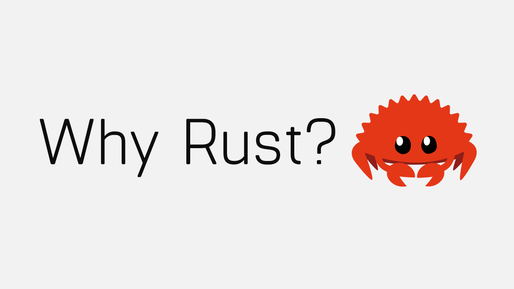
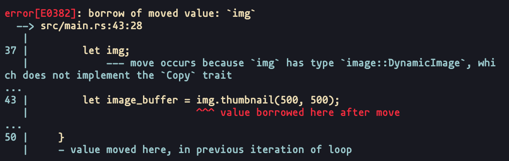

class: middle, center

# Introducción a Rust #

<div></div>

---
class: middle, center

Rust ha sido el lenguaje más querido desde 2016, lo que indica que muchos de los que han tenido la oportunidad de usar Rust se han enamorado de él. Sin embargo, aproximadamente el 97% de los encuestados que no han usado Rust se preguntan: "¿Cuál es el problema con Rust?"

Fuente: [Stack Overflow](https://stackoverflow.blog/2020/01/20/what-is-rust-and-why-is-it-so-popular/)

---
## ¿Qué es Rust? ##

"Rust es un lenguaje de programación de sistemas que funciona increíblemente rápido, evita
Casi todos los valores predeterminados, y garantiza la seguridad del hilo." &ndash;
[rust-lang.org](https://www.rust-lang.org/)

---

## Historia

- Surgió de un proyecto personal en 2006 por el empleado de Mozilla Graydon Hoare, quien dijo que su nombre proviene de una familia de hongos.
- Mozilla comenzó a patrocinar el proyecto en 2009 y lo anunció en 2010.
- En enero de 2014, el editor en jefe del Dr. Dobb's (una de las primeras revistas enfocadas en Software), Andrew Binstock, comentó sobre las posibilidad de Rust de convertirse en un de los competidores principales de C ++ y de los otros como D o Go.
- Rust 1.0, la primera versión estable, se lanzó el 15 de mayo de 2015.
- Desde 2016, Rust es el primer lenguaje de programación más querido en la encuesta anual de Stack Overflow.

---
class: middle, center

<div></div>

---

## ¿Y porqué Rust? ##

Tiene 4 grandes pilares:

- Seguridad.
- Rápidez.
- Lenguage Funcional.
- Sin cargas.

---

### Seguridad ###

- La mayoría de los errores de memoria se descubren cuando se ejecuta un programa.
- Rust detecta problemas relacionados con la memoria (null or dangling pointers, data races, etc.)...
- .. y el compilador fuerza a solucionarlos.

<div></div>

---

### Rápidez ###

- Rust compila a código nativo.
- Rust no tiene recolector de basura.
- La mayoría de las abstracciones tienen costo cero.
- Usa exactamente lo que necesitas ...
- ... y se paga la mayor parte en tiempo de compilación.

---

### Lenguage Funcional ###

- Funciones de primera clase.
- Genéricos basados en rasgos (traits).
- Tipos de datos algebraicos.
- Pattern matching.

---

### Low-overhead ###

- Rust garantiza la seguridad de la memoria sin necesidad de un recolector de basura.
- La memoria se gestiona a través de un sistema de propiedad que el compilador comprueba en el momento de la compilación.
- Cada variable tiene un solo dueño a la vez.

---

## Modelo de lanzamiento ##

- Rust lanza una nueva versión estable cada seis semanas.
- Hay disponibles versiones cada noche.
- Versión estable más reciente: Rust 1.42.

---

## ¿Quién lo usa? ##

<div></div>

---
class: middle, center

## GO vs Rust ##

<div style="display: flex; justify-content: center; align-items: center;"></div>

---

### Lenguaje de programación GO ###

- Go fue introducido en 2007 por Google.
- Surgió como un lenguaje para resolver los problemas que enfrentan las organizaciones cuando desarrollan infraestructura de software.
- La especificación de Go especifica la recolección de basura, la gestión de dependencias, la concurrencia integrada, la solidez a través de múltiples límites entre los componentes, etc.
- Todas estas características bien pensadas de Go le han otorgado una posición en el mercado muy importante respecto de otros lenguajes de programación.

---

### Ventajas de Rust ###

- Mayor velocidad.
- Tiene características de grano fino, como patrones enriquecidos, extensiones de sintaxis e incrustaciones novedosas.
- Interoperable con C y FFI, entre otros.
- Abstracciones con costo cero.
- Comportamiento en tiempo de ejecución más predecible.
- Mejores tiempo de bloqueo y de depuración.

---

### Desventajas de Rust ###

- La curva de aprendizaje de Rust es más pronunciado que en Go.
- R.ust es más lento en compilar.
- En más lento que C y C ++ en condiciones análogas.

(*) Más info en [Go vs Rust: Which is Better and Why?](https://appinventiv.com/blog/go-vs-rust/)

---

## Let's Rust! ##

Hello Rust!

```rust
fn main() {
    println!("Hello Rust!");
}
```
